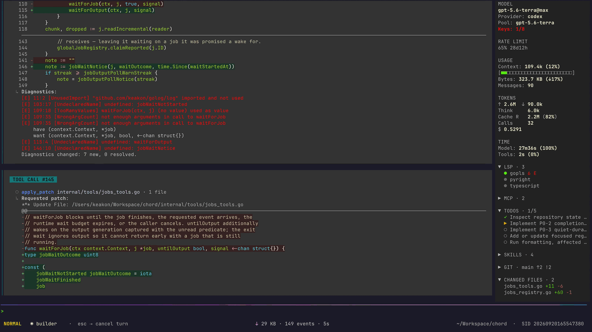

# Chord

[](https://github.com/keakon/chord/actions/workflows/ci.yml) [](https://github.com/keakon/chord/releases) [](./go.mod) [](./LICENSE)

📖 **Docs site:** <https://keakon.github.io/chord/>

🌐 [中文介绍](./README_CN.md)

**Spend fewer tokens, take on harder work.** A lightweight terminal coding agent — no context rot, automatic model switching.

<p align="center">
  
</p>

## Why Chord

- **Long sessions use less context**
- **Fast startup and low memory usage**
- **Shows as much detail as possible**
- **Keyboard-first, Vim-style**
- **Notifies you only when you're needed**
- **Hot-swap model setups**
- **Drive it remotely**
- **Import sessions from Claude Code, Codex, and OpenCode**
- **LSP integration**
- **Preview images in the terminal**
- **Codex subscription quota and reset time**
- **Robust and customizable agent teams**
- **Parallel work via git worktrees**

## Three-step setup

### 1. Install

If you already have Go 1.27.0+ installed:

```bash
go install github.com/keakon/chord/cmd/chord@latest
```

Source builds require Go 1.27.0 or newer; the default `GOTOOLCHAIN=auto` downloads the required toolchain when needed.

If you do not have Go 1.27.0+, download the archive for your OS/architecture from [GitHub Releases](https://github.com/keakon/chord/releases), extract it, put `chord` on your `PATH`, and run:

```bash
chord --version
```

On macOS, the downloaded binary may be blocked on first run because it came from the internet and is not notarized; see [Quickstart](./docs/quickstart.md#1-install) for the `xattr` / `codesign` commands that unblock it.

### 2. Run the setup wizard

Run `chord` in an interactive terminal:

```bash
chord
```

If `config.yaml` is missing, Chord launches a one-time setup wizard: it creates the minimal `config.yaml` and, when needed, `auth.yaml`, then prints the exact paths it used.

To write YAML manually or use a different provider/model setup, see [Quickstart](./docs/quickstart.md).

### 3. Run from your project

```bash
cd my-project && chord
```

For manual provider/model setup and the `limit` fields, see [Quickstart](./docs/quickstart.md) and the [Glossary](./docs/glossary.md); ready-to-paste `config.yaml` files are in [example configs](./docs/examples/index.md).

## Documentation

- [Docs home](./docs/index.md)
- Getting started: [Quickstart](./docs/quickstart.md) · [Usage](./docs/usage.md) · [Glossary](./docs/glossary.md)
- Reference: [CLI](./docs/cli.md) · [Configuration & Auth](./docs/configuration.md) · [Context management](./docs/context-management.md) · [Model configuration recipes](./docs/model-configs.md) · [Built-in tools](./docs/tools.md) · [Edit tools](./docs/edit-tools.md) · [Keybindings](./docs/keybindings.md) · [Paths](./docs/paths.md) · [Environment variables](./docs/environment.md) · [Platform support](./docs/platforms.md) · [Performance](./docs/performance.md)
- Going further: [Customization](./docs/customization.md) · [Hooks](./docs/hooks.md) · [Examples](./docs/examples/index.md)
- Integration: [Headless](./docs/headless.md) (`chord headless`)
- Safety: [Permissions & Safety](./docs/permissions-and-safety.md)
- Troubleshooting: [Troubleshooting](./docs/troubleshooting.md)

## Performance snapshot

In one Chord v0.6.3 run of a [real-world Pebble database task](https://github.com/datacurve-ai/deep-swe/tree/main/tasks/pebble-durability-wait-apis), Chord completed the task in 46m21s using 6.86M input tokens and an estimated $5.58. A Codex-CLI v0.136.0 comparison run using the same GPT-5.5 (xhigh) model took 61m18s, 18.47M input tokens, and an estimated $15.15.

This is a single measured scenario, not a general guarantee. See [Performance — Measured results](./docs/performance.md#measured-results) for the full tables (including app startup and memory) and methodology.

## Project links

- Companion: [keakon/chord-gateway](https://github.com/keakon/chord-gateway)
- [Contributing](./CONTRIBUTING.md)
- [Changelog](./CHANGELOG.md)
- [Issues](https://github.com/keakon/chord/issues)

## Platform support

Chord is developed and tested primarily on macOS. Linux works well; Windows mostly works but may have undiscovered bugs. Some features (`prevent_sleep`) are macOS-only and silently no-op elsewhere. See [Platform support](./docs/platforms.md) for the per-feature matrix.

## Acknowledgements

Chord is built on [Bubble Tea](https://github.com/charmbracelet/bubbletea), with design and feature inspiration from Claude Code, Codex, OpenCode, and Crush. Most of its development was assisted by GPT-5.4/5.5. Thanks to the many community-run API proxies on [linux.do](https://linux.do/) for providing token access.

## License

MIT License. See [LICENSE](./LICENSE).
