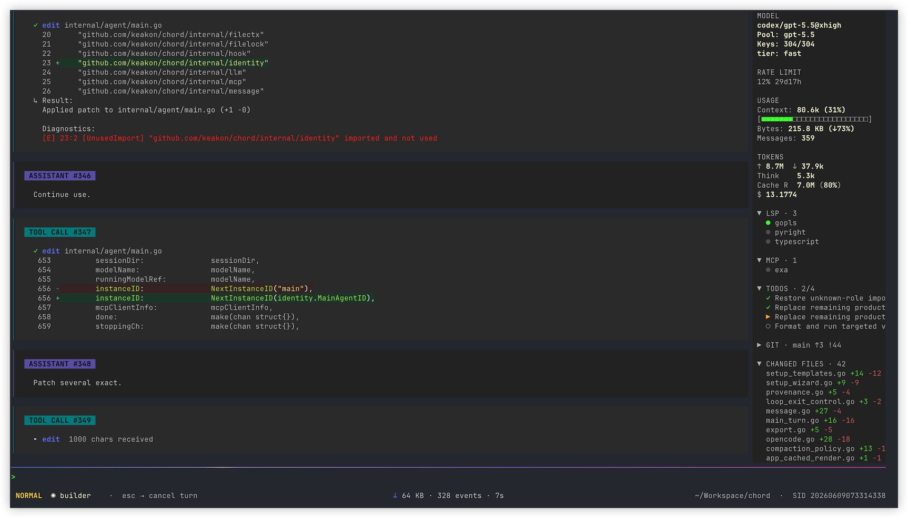

# Chord

[](https://github.com/keakon/chord/actions/workflows/ci.yml) [](https://github.com/keakon/chord/releases) [](./go.mod) [](./LICENSE)

📖 **文档站：** <https://keakon.github.io/chord/zh/>

🌐 [English introduction](./README.md)

**让 AI 编码体验从容下来。** 一个轻量、本地优先的终端 Coding Agent——会话再长也不崩、模型组合可热切换、脱离电脑时还能远程操控。

- 配套网关：[keakon/chord-gateway](https://github.com/keakon/chord-gateway) —— 把 Chord 接到微信、飞书等聊天平台

<p align="center">
  
</p>

## 为什么选 Chord

先说最容易感受到的核心体验：

- **长会话更省上下文。** Chord 会在请求时剪裁陈旧工具输出，并用类型化摘要保留搜索结果、JSON 大块、构建 / 测试日志和文件读取的关键信息；接近模型 token 上限前，还可以在后台压缩早期内容。结合 `/loop`，复杂任务可以连续运行数小时，同时减少无效 token 消耗。
- **轻量常驻。** Chord 能近乎瞬间加载上千条消息的历史会话，退出无需等待；内存占用低，空闲数分钟后会卸载 LSP/MCP 资源，下次请求再恢复。
- **网络状态全程可见。** 等模型响应时，Chord 实时显示请求状态和已等待时间。再也不用猜「是不是卡住了」。
- **键盘优先、Vim 风格。** 面向习惯全键盘操作的用户：Insert / Normal 模式、Vim 风格导航、消息搜索，还可配置为在模式切换时自动切换输入法。退出需连按两次，避免误触 Ctrl+C 丢工作。
- **模型组合热切换。** 将模型分组到可复用的池（`fast`、`thinking`、`cheap` 等），运行时用 `/models` 或 `Ctrl+P` 切换。每个 agent 独立选池；运行时自动按池内顺序 fallback。
- **能远程操控。** `chord headless` 提供 stdio JSONL 控制面；配合 [chord-gateway](https://github.com/keakon/chord-gateway) 可从微信、飞书等聊天平台驱动 Chord。
- **能迁移旧会话。** `chord import` 可把 Claude Code、Codex、OpenCode 会话迁移成可恢复的 Chord 会话。

开箱即用，还有这些体验增强能力：

- **项目上下文** —— 接入本地 language server，提供实时诊断和 definition / reference / implementation 查询；同时展示 Git 状态，支持 `@` 文件补全。
- **图片和 PDF 输入** —— 粘贴图片，按模型能力附加图片或 PDF，在支持的终端中预览图片；支持图片输入的模型还可以用 `view_image` 查看本地 PNG/JPEG。
- **Codex 额度可见** —— 实时显示 OpenAI Codex 订阅的剩余额度和重置时间。

熟悉之后，还可以进一步用这些进阶工作流：

- **多 Agent 协作** —— 主 agent 派出 SubAgent，每个拥有独立 context；`Shift+Tab` 切换视图。
- **基于 git worktree 的并行任务** —— `chord --worktree feat-auth` 启动独立 worktree，多任务在同仓库下互不干扰。

## 三步上手

### 1. 安装

已安装 Go 1.26.3+ 时：

```bash
go install github.com/keakon/chord/cmd/chord@latest
```

源码构建要求 Go 1.26.3 或更新版本，因为更早的 Go 1.26 patch 版本存在可达的标准库漏洞。默认 `GOTOOLCHAIN=auto` 时，Go 会在需要时自动下载所需 toolchain。

未安装 Go 1.26.3+ 时，可从 [GitHub Releases](https://github.com/keakon/chord/releases) 下载预构建二进制。选择与 OS/架构匹配的压缩包，解压后把 `chord` 放入 `PATH`，然后执行：

```bash
chord --version
```

### 2. 先运行一次初始化向导

在交互式终端里直接运行：

```bash
chord
```

如果缺少 `config.yaml`，Chord 会启动一次性的初始化向导。向导会创建最小可用的 `config.yaml`，必要时再创建 `auth.yaml`，并在结束时展示实际路径。

如果你更希望手写 YAML，或需要不同的 provider / 模型配置，见[快速开始](./docs/quickstart_CN.md)。

### 3. 在项目里启动

```bash
cd my-project && chord
```

手动配置 provider / 模型以及理解模型限制，见[快速开始](./docs/quickstart_CN.md)。简而言之：`limit.context` 是总请求窗口，`limit.output` 是模型的最大输出能力，`limit.input` 只在 provider 单独公布输入上限时才需要配置。完整规则见[术语表](./docs/glossary_CN.md)，可直接复制粘贴的 `config.yaml` 见[示例配置库](./docs/examples/index_CN.md)。

### Release 下载说明

GitHub Releases 提供多个支持平台的预构建二进制。macOS 下载版首次运行时可能因文件来自互联网且未公证而被系统阻止，解除阻止的 `xattr` / `codesign` 命令见[快速开始 — 安装](./docs/quickstart_CN.md#1-安装)。

## 文档

- [文档首页](./docs/index_CN.md)
- 入门：[快速开始](./docs/quickstart_CN.md) · [使用指南](./docs/usage_CN.md) · [术语表](./docs/glossary_CN.md)
- 参考：[CLI](./docs/cli_CN.md) · [配置与认证](./docs/configuration_CN.md) · [上下文管理](./docs/context-management_CN.md) · [模型配置速查](./docs/model-configs_CN.md) · [内置工具](./docs/tools_CN.md) · [编辑工具](./docs/edit-tools_CN.md) · [快捷键](./docs/keybindings_CN.md) · [目录与路径](./docs/paths_CN.md) · [环境变量](./docs/environment_CN.md) · [平台支持](./docs/platforms_CN.md) · [性能](./docs/performance_CN.md)
- 进阶：[扩展与定制](./docs/customization_CN.md) · [Hooks](./docs/hooks_CN.md) · [示例配置库](./docs/examples/index_CN.md)
- 集成：[Headless](./docs/headless_CN.md)
- 安全：[权限与安全](./docs/permissions-and-safety_CN.md)
- 排障：[常见问题排查](./docs/troubleshooting_CN.md)

## 性能摘要

在 Chord v0.6.3 的一次[真实 Pebble 数据库任务](https://github.com/datacurve-ai/deep-swe/tree/main/tasks/pebble-durability-wait-apis)测试中，Chord 用时 46m21s，使用 6.86M 输入 token，估算成本为 $5.58。同样使用 GPT-5.5（xhigh）的 Codex-CLI v0.136.0 对照运行用时 61m18s，使用 18.47M 输入 token，估算成本为 $15.15。

这只是单次场景实测，不代表普遍结果。硬件、运行环境、会话内容、模型行为和实现路径都会影响结果。Chord 如何保持长会话流畅，以及遇到性能问题时应收集哪些信息，见[性能](./docs/performance_CN.md)。

## 项目链接

- 配套：[keakon/chord-gateway](https://github.com/keakon/chord-gateway)
- [贡献指南](./CONTRIBUTING.md)
- [Changelog（中文）](./CHANGELOG_CN.md)
- [问题反馈](https://github.com/keakon/chord/issues)

## 平台支持

Chord 主要在 macOS 上开发和测试。Linux 表现良好；Windows 大体可用但可能存在未发现的 bug。`prevent_sleep` 等少数能力仅 macOS 生效，其他平台静默 no-op。具体能力矩阵见 [平台支持](./docs/platforms_CN.md)。

## 致谢

Chord 基于 [Bubble Tea](https://github.com/charmbracelet/bubbletea) 构建，设计与功能借鉴了 Claude Code、Codex、OpenCode 和 Crush，主要使用 GPT-5.4/5.5 辅助开发。感谢 [linux.do](https://linux.do/) 上大量公益站提供 tokens。

## License

MIT License，详见 [LICENSE](./LICENSE)。
